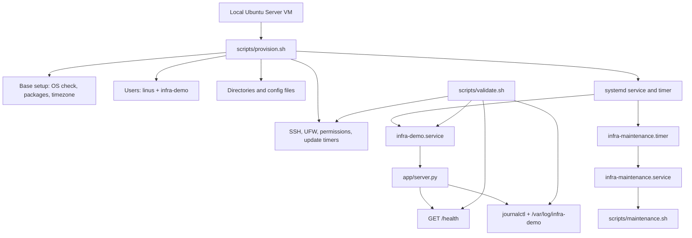
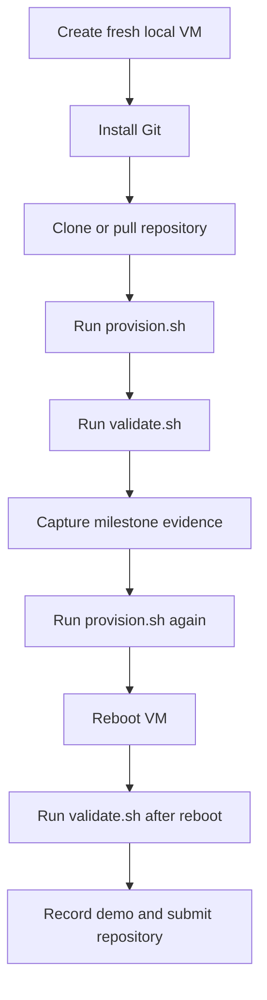

# Linux Server Baseline Provisioning Lab

A reproducible local-VM provisioning project for preparing a small Linux server
baseline. The project installs required packages, creates operational accounts,
deploys a systemd-managed demo service, applies basic hardening, schedules
maintenance automation, and validates the result before and after reboot.

The lab is scoped to a **local virtual machine only**. It does not use cloud
VMs, cloud images, cloud accounts, or host-machine destructive actions.

## Scope

| Area | Decision |
|---|---|
| Target OS | Ubuntu Server 22.04 LTS or 24.04 LTS |
| Primary automation | Bash |
| Demo service | Small Python HTTP health service |
| Service manager | systemd |
| Firewall | UFW |
| Evidence source | VMware console screenshots and terminal logs from the local VM |
| Repo workflow | Edit on host, push to GitHub, pull and run inside the VM |

## Service Choice

The assignment allows either `nginx` or a small Python-based HTTP health
service. This project uses the Python option only for the demo service:

- `scripts/provision.sh` remains the Bash provisioning entrypoint.
- `app/server.py` provides `GET /health` on port `8080`.
- systemd runs the service as `infra-demo`, not as root.
- Logs are available through `journalctl` and `/var/log/infra-demo/`.
- Runtime configuration is loaded from `/etc/infra-demo/infra-demo.env`.

## Architecture



## Workflow



## Repository Layout

```text
linux-infra-intern-assignment/
+-- README.md
+-- app/
|   +-- server.py
+-- config/
|   +-- infra-demo.env
+-- docs/
|   +-- fr-milestone-map.md
|   +-- hardening-checklist.md
|   +-- local-vm-reprovisioning.md
|   +-- test-plan.md
|   +-- troubleshooting.md
+-- evidence/
|   +-- .gitkeep
+-- scripts/
|   +-- maintenance.sh
|   +-- provision.sh
|   +-- validate.sh
+-- systemd/
    +-- infra-demo.service
    +-- infra-maintenance.service
    +-- infra-maintenance.timer
```

## Component Map

| Path | Purpose |
|---|---|
| `scripts/provision.sh` | Main provisioning script for packages, users, directories, service deployment, hardening, and automation setup. |
| `scripts/validate.sh` | Validation script for service state, health endpoint, firewall, users, permissions, logs, and reboot checks. |
| `scripts/maintenance.sh` | Periodic housekeeping script for old log cleanup and health snapshot collection. |
| `app/server.py` | Lightweight HTTP health service used by `infra-demo.service`. |
| `config/infra-demo.env` | Non-secret runtime configuration for host, port, and log directory. |
| `systemd/infra-demo.service` | systemd unit that starts the demo health service on boot. |
| `systemd/infra-maintenance.service` | systemd oneshot unit that runs maintenance work. |
| `systemd/infra-maintenance.timer` | systemd timer that schedules the maintenance service. |
| `docs/hardening-checklist.md` | Security controls applied, reasons for each control, and controls intentionally skipped. |
| `docs/local-vm-reprovisioning.md` | Local VM snapshot, restore, and rerun workflow. |
| `docs/test-plan.md` | Manual and automated validation plan. |
| `docs/troubleshooting.md` | Recovery notes for common provisioning, SSH, firewall, service, and timer issues. |
| `docs/fr-milestone-map.md` | Functional requirement and milestone traceability map. |
| `evidence/` | Screenshots or terminal logs for milestone proof. |

## Requirement Coverage

| Requirement | Coverage |
|---|---|
| FR1 - Base setup | `provision.sh` detects Ubuntu, updates apt metadata, installs packages, sets timezone, and creates `linus`. |
| FR2 - Service setup | `infra-demo.service` runs the health service and is enabled on boot. |
| FR3 - Logs and config | `infra-demo.env` controls runtime settings; logs are available through journald and `/var/log/infra-demo`. |
| FR4 - Automation quality | Provisioning is idempotent: reruns do not duplicate users or break the service. |
| FR5 - Basic hardening | SSH safe defaults, UFW rules, restricted file modes, service account isolation, and update timers are applied. |
| FR6 - Local reprovisioning | Snapshot and restore workflow is documented in `docs/local-vm-reprovisioning.md`. |
| FR7 - Validation | `validate.sh` checks service, health, ports, firewall, users, permissions, and logs. |
| FR8 - Reboot survival | `validate.sh` is run before and after reboot to prove service persistence. |

## Quick Start

Run these commands inside the local VM.

```bash
sudo apt-get update
sudo apt-get install -y git
git clone <repo-url> linux-infra-intern-assignment
cd linux-infra-intern-assignment
```

Provision the server:

```bash
sudo bash scripts/provision.sh
```

Validate the result:

```bash
sudo bash scripts/validate.sh
```

Run the idempotency check:

```bash
sudo bash scripts/provision.sh
sudo bash scripts/validate.sh
```

Run the reboot survival check:

```bash
sudo reboot
```

After the VM is back online:

```bash
cd ~/linux-infra-intern-assignment
uptime
sudo bash scripts/validate.sh
```

## Manual Evidence Commands

Use these commands for screenshots or terminal logs.

```bash
lsb_release -a
uname -a
pwd
tree -L 3
id linus
systemctl is-enabled infra-demo
systemctl is-active infra-demo
systemctl status infra-demo
curl -i http://localhost:8080/health
journalctl -u infra-demo --no-pager -n 30
ufw status verbose
ss -ltnp
systemctl list-timers infra-maintenance.timer
stat -c "%U:%G %a %n" /etc/infra-demo/infra-demo.env /var/log/infra-demo
```

## Milestone Evidence Plan

| Milestone | Evidence |
|---|---|
| M1 - Base VM + repo setup | OS version, kernel, repo tree, first successful provisioning run. |
| M2 - Service + systemd | `systemctl status infra-demo`, `/health` response, recent journal logs. |
| M3 - Hardening + automation | UFW status, timer status, permissions check, second provisioning run. |
| M4 - Validation + reboot testing | `validate.sh` output before reboot and after reboot. |
| M5 - Cleanup + documentation + demo | Final repository, organized evidence folder, demo video link. |

## Hardening Summary

Applied controls:

- root SSH login disabled
- empty SSH passwords disabled
- X11 forwarding disabled
- authentication attempts limited
- UFW default incoming policy set to deny
- only SSH and the demo service port allowed
- service runs as a no-login system account
- config file installed as `root:infra-demo` with mode `640`
- systemd service uses basic sandboxing directives
- apt daily update timers enabled

Full reasoning is documented in `docs/hardening-checklist.md`.

## Local Reprovisioning

The reproducible local workflow is:

1. Create a clean Ubuntu Server VM.
2. Install Git.
3. Take a local VM snapshot.
4. Clone or pull the repository.
5. Run `scripts/provision.sh`.
6. Run `scripts/validate.sh`.
7. Restore the snapshot and repeat to prove the flow is reproducible.

Detailed steps are in `docs/local-vm-reprovisioning.md`.

## Troubleshooting

Common checks:

```bash
systemctl status infra-demo
journalctl -u infra-demo --no-pager -n 50
ss -ltnp
ufw status verbose
sshd -t
systemctl list-timers infra-maintenance.timer
```

See `docs/troubleshooting.md` for recovery notes.

## Demo Video

Demo link:

```text
<add demo video link>
```

The demo should show:

1. local VM environment
2. provisioning run
3. systemd service health
4. validation output
5. reboot survival

## AI Assistance Notes

AI assistance was used for:

- requirement breakdown and milestone planning
- command explanation and Bash review
- systemd, UFW, SSH, and validation-script review
- README and documentation structure

All submitted commands and configuration are expected to be understood and
verified in the local VM. Evidence should come from actual VM output, including
`systemctl`, `curl`, `journalctl`, `ufw`, `ss`, and `validate.sh` results.

No secrets, private keys, passwords, tokens, or cloud credentials are required
or committed.
