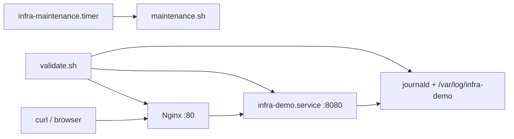

# Linux Server Baseline Provisioning Lab

A reproducible local-VM Linux provisioning project for preparing a small server baseline. The project installs required packages, creates operational users, deploys a systemd-managed demo service behind Nginx, applies basic hardening, configures maintenance automation, and validates the setup before and after reboot.

The lab is designed for a local virtual machine only. It does not require or use any cloud VM, cloud provider account, or destructive host-machine operations.

## Scope

| Area                   | Implementation                                                                  |
| ---------------------- | ------------------------------------------------------------------------------- |
| Target platform        | Local Ubuntu Server 22.04 LTS or 24.04 LTS VM                                   |
| Primary automation     | Bash                                                                            |
| Service manager        | systemd                                                                         |
| HTTP frontend          | Nginx on port `80`                                                              |
| Backend service        | Python standard-library HTTP service on `127.0.0.1:8080`                        |
| Runtime config         | `/etc/infra-demo/infra-demo.env`                                                |
| Firewall               | UFW                                                                             |
| Evidence               | Local VM screenshots under `evidence/`                                          |
| Optional stretch goals | Ansible, monitoring, Docker notes, rollback dry-run, VM snapshot/template notes |

## Architecture



## Provisioning Flow


## Repository Layout

```text
linux-infra-intern-lab/
├── README.md
├── .dockerignore
├── config/
│   └── infra-demo.env
├── scripts/
│   ├── provision.sh
│   ├── validate.sh
│   └── maintenance.sh
├── systemd/
│   ├── infra-demo.service
│   ├── infra-maintenance.service
│   └── infra-maintenance.timer
├── service/
│   └── infra-demo/
│       ├── nginx_server/
│       │   └── infra_demo.conf
│       └── python_server/
│           └── infra_demo.py
├── docs/
│   ├── fr-milestone-map.md
│   ├── hardening-checklist.md
│   ├── local-vm-reprovisioning.md
│   ├── test-plan.md
│   └── troubleshooting.md
├── evidence/
│   └── milestone screenshots
└── bonus/
    ├── README.md
    ├── ansible/
    │   ├── README.md
    │   └── playbook.yml
    ├── docker/
    │   ├── Dockerfile
    │   ├── README.md
    │   └── run-docker-demo.sh
    ├── monitoring/
    │   ├── README.md
    │   ├── check-infra-demo.sh
    │   └── node-exporter-notes.md
    ├── rollback/
    │   ├── README.md
    │   └── uninstall-infra-demo.sh
    └── vm-snapshot-and-template/
        └── README.md
```

## Component Summary

| Path                                              | Purpose                                                                                                                                                                     |
| ------------------------------------------------- | --------------------------------------------------------------------------------------------------------------------------------------------------------------------------- |
| `scripts/provision.sh`                            | Main idempotent Bash provisioning script. Installs packages, creates users, deploys service files, configures Nginx/systemd/UFW, applies hardening, and enables automation. |
| `scripts/validate.sh`                             | Validation script for service state, HTTP health, firewall, users, permissions, logs, and reboot survival checks.                                                           |
| `scripts/maintenance.sh`                          | Periodic maintenance script for log cleanup and health snapshot collection.                                                                                                 |
| `service/infra-demo/python_server/infra_demo.py`  | Python backend service. Serves `/` and `/health`.                                                                                                                           |
| `service/infra-demo/nginx_server/infra_demo.conf` | Nginx frontend configuration for publishing the demo service on port `80`.                                                                                                  |
| `config/infra-demo.env`                           | Non-secret runtime configuration used by the systemd service.                                                                                                               |
| `systemd/infra-demo.service`                      | systemd unit for the Python backend service.                                                                                                                                |
| `systemd/infra-maintenance.service`               | systemd oneshot service for maintenance work.                                                                                                                               |
| `systemd/infra-maintenance.timer`                 | systemd timer for scheduled maintenance.                                                                                                                                    |
| `docs/hardening-checklist.md`                     | Security settings applied, reasoning, and intentionally skipped items.                                                                                                      |
| `docs/local-vm-reprovisioning.md`                 | Local VM snapshot, restore, and rerun workflow.                                                                                                                             |
| `docs/test-plan.md`                               | Manual and automated validation plan.                                                                                                                                       |
| `docs/troubleshooting.md`                         | Recovery notes for service, firewall, SSH, and provisioning issues.                                                                                                         |
| `docs/fr-milestone-map.md`                        | Functional requirement and milestone traceability map.                                                                                                                      |
| `bonus/`                                          | Optional stretch-goal material. Not required for the baseline provisioning flow.                                                                                            |

## Requirement Coverage

| Requirement                | Implementation                                                                                                                                  |
| -------------------------- | ----------------------------------------------------------------------------------------------------------------------------------------------- |
| FR1 - Base setup           | `provision.sh` detects Ubuntu, updates apt metadata, installs required packages, configures timezone, and creates the `linus` operational user. |
| FR2 - Service setup        | `infra-demo.service` runs the Python backend; Nginx exposes the service on port `80`.                                                           |
| FR3 - Logs and config      | `infra-demo.env` stores runtime config; logs are available through journald, Nginx logs, and `/var/log/infra-demo`.                             |
| FR4 - Automation quality   | Provisioning can be rerun safely without duplicating users or breaking service configuration.                                                   |
| FR5 - Basic hardening      | SSH safe defaults, UFW rules, restricted file modes, service account isolation, and update timers are applied.                                  |
| FR6 - Local reprovisioning | Local VM snapshot and restore workflow is documented in `docs/local-vm-reprovisioning.md`.                                                      |
| FR7 - Validation           | `validate.sh` checks service state, HTTP health, firewall, ports, users, permissions, and logs.                                                 |
| FR8 - Reboot survival      | Validation is performed before and after reboot to prove that services restart correctly.                                                       |

## Quick Start

Run inside the local Ubuntu VM:

```bash
sudo apt-get update
sudo apt-get install -y git curl
git clone <repo-url> linux-infra-intern-lab
cd linux-infra-intern-lab
```

Provision the server:

```bash
sudo bash scripts/provision.sh
```

Validate the setup:

```bash
sudo bash scripts/validate.sh
```

Check HTTP endpoints:

```bash
curl -i http://localhost/
curl -i http://localhost/nginx-check
curl -i http://localhost/health
curl -i http://localhost:8080/health
```

Run idempotency proof:

```bash
sudo bash scripts/provision.sh
sudo bash scripts/validate.sh
```

Run reboot validation:

```bash
sudo reboot
```

After logging back in:

```bash
cd ~/linux-infra-intern-lab
uptime
sudo bash scripts/validate.sh
```

## Evidence Checklist

Screenshots are stored under `evidence/`.

| File                                       | Evidence                                                                |
| ------------------------------------------ | ----------------------------------------------------------------------- |
| `milestone-1-setup.png`                    | Local VM OS details, repository structure, and Git history.             |
| `milestone-2-provision-first-run.png`      | Successful first provisioning run.                                      |
| `milestone-2-service.png`                  | systemd service state, Nginx state, health endpoint, and journald logs. |
| `milestone-3-hardening.png`                | UFW status, listening ports, and maintenance timer state.               |
| `milestone-3-permissions.png`              | Operational user, service user, and key file permissions.               |
| `milestone-3-idempotency.png`              | Second provisioning run showing repeatability.                          |
| `milestone-4-validation-before-reboot.png` | Successful validation before reboot.                                    |
| `final-reboot-validation.png`              | Uptime and successful validation after reboot.                          |
| `bonus-ansible-check.png`                  | Optional Ansible check/diff validation.                                 |
| `bonus-monitoring-rollback-dryrun.png`     | Optional monitoring output and rollback dry-run proof.                  |

## Hardening Summary

Applied controls:

* root SSH login disabled
* empty SSH passwords disabled
* X11 forwarding disabled
* SSH authentication attempts limited
* UFW default incoming policy set to deny
* SSH and HTTP/Nginx allowed
* backend service bound to loopback
* service runs as a no-login `infra-demo` system account
* config file installed as `root:infra-demo` with restricted mode
* systemd sandboxing directives applied
* apt daily update timers enabled

Full details are documented in `docs/hardening-checklist.md`.

## Optional Stretch Goals

Optional stretch-goal material is included under `bonus/`.

| Stretch goal                                 | Location                                   |
| -------------------------------------------- | ------------------------------------------ |
| Ansible equivalent of provisioning flow      | `bonus/ansible/playbook.yml`               |
| Local VM snapshot and restore workflow       | `bonus/vm-snapshot-and-template/README.md` |
| Local VM template/export notes               | `bonus/vm-snapshot-and-template/README.md` |
| Monitoring checks and node_exporter notes    | `bonus/monitoring/`                        |
| Docker packaging of the demo backend         | `bonus/docker/`                            |
| Rollback/uninstall script with safety checks | `bonus/rollback/`                          |

## Bonus Verification

Ansible syntax and check mode:

```bash
sudo apt-get update
sudo apt-get install -y ansible-core
ansible --version
ansible-playbook -i localhost, -c local bonus/ansible/playbook.yml --syntax-check
ansible-playbook -i localhost, -c local bonus/ansible/playbook.yml --check --diff
```

Ansible apply and validation:

```bash
ansible-playbook -i localhost, -c local bonus/ansible/playbook.yml
sudo bash scripts/validate.sh
```

Monitoring and rollback dry-run:

```bash
bash -n bonus/monitoring/check-infra-demo.sh
sudo bash bonus/monitoring/check-infra-demo.sh
bash -n bonus/rollback/uninstall-infra-demo.sh
sudo bash bonus/rollback/uninstall-infra-demo.sh --dry-run
```

Docker proof, if Docker is already installed:

```bash
docker --version
bash -n bonus/docker/run-docker-demo.sh
bash bonus/docker/run-docker-demo.sh
```

If Docker is not already installed, the Docker stretch goal can remain documented instead of executed.

## Troubleshooting

Check service state:

```bash
systemctl status infra-demo nginx --no-pager
journalctl -u infra-demo --no-pager -n 50
```

Check Nginx configuration:

```bash
sudo /usr/sbin/nginx -t
```

Check network and firewall state:

```bash
sudo ss -ltnp
sudo ufw status verbose
```

Check SSH configuration:

```bash
sudo sshd -t
```

Check maintenance timer:

```bash
systemctl list-timers infra-maintenance.timer --no-pager
sudo systemctl start infra-maintenance.service
sudo cat /var/lib/infra-demo/last-snapshot.txt
```

Run full validation:

```bash
sudo bash scripts/validate.sh
```

## Demo Video

```text
1. repository sturtcure overview : https://bit.ly/4fSuiCp
2. Demo on VMware : https://bit.ly/3QK1X78
```

## Safety Notes

* Scripts are scoped to the local VM lab.
* No cloud VM or cloud provider is required.
* No script formats disks, repartitions storage, or modifies the Windows host.
* Rollback defaults to dry-run and requires explicit execution confirmation.
* SSH access is not disabled.
* Root SSH login and unsafe SSH defaults are restricted.
* No private keys, passwords, credentials, API tokens, or secrets should be committed.

## Final Submission Checklist

Before submission, verify:

```bash
git status --branch --short
git log --oneline -8
sudo bash scripts/provision.sh
sudo bash scripts/validate.sh
curl -i http://localhost/
curl -i http://localhost/nginx-check
curl -i http://localhost/health
```

Final repository should includes:

* accessible GitHub repository
* clear README
* provisioning script
* validation script
* systemd service and timer files
* hardening checklist
* local VM evidence screenshots
* demo video link
* meaningful Git history
* no secrets
* no cloud VM references

## AI Assistance Notes

AI assistance was used for research support, boilerplate drafting, documentation editing, and review against the assignment requirements.

AI helped with:

* mapping assignment requirements to FR1-FR8
* organizing the milestone evidence plan
* explaining Linux, systemd, Nginx, UFW, Ansible, Docker, and rollback concepts
* drafting and refining scripts, service files, and documentation
* reviewing the project for unsafe paths, secret-like content, cloud references, and unnecessary files

Manual verification was performed inside a local VMware Ubuntu VM by:

* running `scripts/provision.sh`
* checking systemd service state
* validating Nginx and `/health`
* reviewing firewall rules
* checking users and permissions
* running `scripts/validate.sh`
* rebooting the VM
* running validation again after reboot
* collecting local VM screenshot evidence
