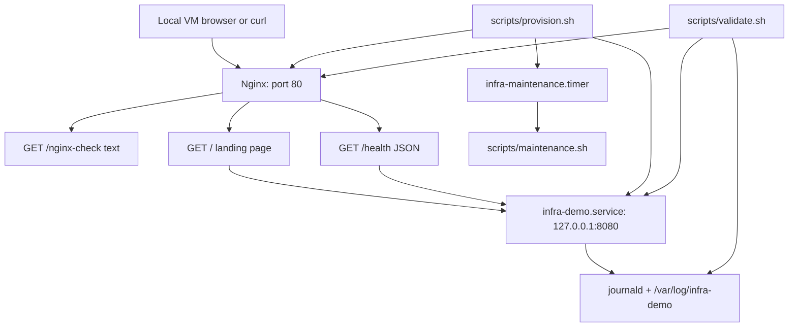
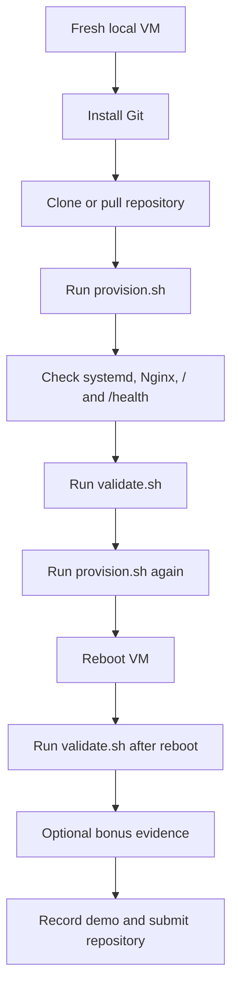

# Linux Server Baseline Provisioning Lab

A reproducible local-VM provisioning project for preparing a small Linux server
baseline. The project installs required packages, creates operational accounts,
deploys a systemd-managed demo service behind Nginx, applies basic hardening,
schedules maintenance automation, and validates the result before and after
reboot.

The lab is scoped to a local virtual machine only. It does not use a cloud VM,
cloud account, or host-machine destructive actions.

## Scope

| Area | Decision |
|---|---|
| Target OS | Ubuntu Server 22.04 LTS or 24.04 LTS |
| Primary automation | Bash |
| Service manager | systemd |
| HTTP frontend | Nginx on port `80` |
| Backend service | Python standard-library HTTP service on `127.0.0.1:8080` |
| Firewall | UFW |
| Evidence source | Local VM screenshots and terminal logs |
| Bonus scope | Optional Ansible, Docker, monitoring, rollback, and VM snapshot notes |

## Architecture



## Workflow



## Repository Layout

```text
linux-infra-intern-lab/
  README.md
  .dockerignore

  config/
    infra-demo.env

  scripts/
    provision.sh
    validate.sh
    maintenance.sh

  systemd/
    infra-demo.service
    infra-maintenance.service
    infra-maintenance.timer

  service/
    infra-demo/
      nginx_server/
        infra_demo.conf
      python_server/
        infra_demo.py

  docs/
    fr-milestone-map.md
    hardening-checklist.md
    local-vm-reprovisioning.md
    test-plan.md
    troubleshooting.md

  evidence/
    milestone screenshots and terminal proof

  bonus/
    README.md
    README-BONUS-SECTION.md
    ansible/
      README.md
      playbook.yml
    docker/
      Dockerfile
      README.md
      run-docker-demo.sh
    monitoring/
      README.md
      check-infra-demo.sh
      node-exporter-notes.md
    rollback/
      README.md
      uninstall-infra-demo.sh
    vm-snapshot-and-template/
      README.md
```

## Component Map

| Path | Purpose |
|---|---|
| `scripts/provision.sh` | Main Bash provisioning script for packages, users, directories, service deployment, Nginx, hardening, and automation setup. |
| `scripts/validate.sh` | Validation script for service state, HTTP health, firewall, users, permissions, logs, idempotency evidence, and reboot checks. |
| `scripts/maintenance.sh` | Periodic housekeeping script for old log cleanup and health snapshot collection. |
| `service/infra-demo/python_server/infra_demo.py` | Backend HTTP service. Serves `/` as a small status page and `/health` as JSON. |
| `service/infra-demo/nginx_server/infra_demo.conf` | Nginx frontend. Publishes `/nginx-check`, `/`, and `/health` on port `80`. |
| `config/infra-demo.env` | Non-secret runtime configuration for host, port, and log directory. |
| `systemd/infra-demo.service` | systemd unit that starts the backend service on boot. |
| `systemd/infra-maintenance.service` | systemd oneshot unit that runs maintenance work. |
| `systemd/infra-maintenance.timer` | systemd timer that schedules maintenance. |
| `docs/hardening-checklist.md` | Applied hardening controls, reasoning, and intentionally skipped controls. |
| `docs/local-vm-reprovisioning.md` | Local VM snapshot, restore, and rerun workflow. |
| `docs/test-plan.md` | Manual and automated validation plan. |
| `docs/troubleshooting.md` | Recovery notes for provisioning, SSH, firewall, service, and timer issues. |
| `docs/fr-milestone-map.md` | Functional requirement and milestone traceability map. |
| `bonus/` | Optional stretch-goal material. Not required for the baseline flow. |
| `.dockerignore` | Keeps Docker build context small by excluding Git data, screenshots, docs, and unrelated bonus folders. |

## Requirement Coverage

| Requirement | Coverage |
|---|---|
| FR1 - Base setup | `provision.sh` detects Ubuntu, updates apt metadata, installs packages, sets timezone, and creates `linus`. |
| FR2 - Service setup | `infra-demo.service` runs the backend service and Nginx exposes it on port `80`. |
| FR3 - Logs and config | `infra-demo.env` controls runtime settings; logs are available through journald, Nginx logs, and `/var/log/infra-demo`. |
| FR4 - Automation quality | Provisioning is idempotent: reruns do not duplicate users or break the service. |
| FR5 - Basic hardening | SSH safe defaults, UFW rules, restricted file modes, service account isolation, and update timers are applied. |
| FR6 - Local reprovisioning | Snapshot and restore workflow is documented in `docs/local-vm-reprovisioning.md`. |
| FR7 - Validation | `validate.sh` checks service, health, ports, firewall, users, permissions, and logs. |
| FR8 - Reboot survival | `validate.sh` is run before and after reboot to prove service persistence. |

## Quick Start

Run inside the local VM:

```bash
sudo apt-get update
sudo apt-get install -y git
git clone <repo-url> linux-infra-intern-lab
cd linux-infra-intern-lab
```

Provision:

```bash
sudo bash scripts/provision.sh
```

Validate:

```bash
sudo bash scripts/validate.sh
```

Check the web endpoints:

```bash
curl -i http://localhost/
curl -i http://localhost/nginx-check
curl -i http://localhost/health
curl -i http://localhost:8080/health
curl -s http://localhost/ | grep "Hello from infra-demo local VM"
```

Run the idempotency check:

```bash
sudo bash scripts/provision.sh
sudo bash scripts/validate.sh
```

Run the reboot survival check:

```bash
sudo reboot
```

After the VM is back online:

```bash
cd ~/linux-infra-intern-lab
uptime
sudo bash scripts/validate.sh
```

## Manual Evidence Commands

```bash
lsb_release -a
uname -a
pwd
tree -L 3
id linus
systemctl is-enabled infra-demo
systemctl is-active infra-demo
systemctl status infra-demo
curl -i http://localhost/
curl -i http://localhost/nginx-check
curl -i http://localhost/health
curl -s http://localhost/ | grep "Hello from infra-demo local VM"
journalctl -u infra-demo --no-pager -n 30
ufw status verbose
sudo ss -ltnp
systemctl list-timers infra-maintenance.timer
sudo stat -c "%U:%G %a %n" /etc/infra-demo/infra-demo.env /var/log/infra-demo
sudo cat /var/lib/infra-demo/last-snapshot.txt
```

To save terminal-log evidence in the repository:

```bash
mkdir -p evidence
script -a evidence/manual-validation.log
sudo bash scripts/validate.sh
journalctl -u infra-demo --no-pager -n 30
sudo ufw status verbose
exit
```

## Milestone Evidence Plan

| Milestone | Evidence |
|---|---|
| M1 - Base VM + repo setup | OS version, kernel, repo tree, first successful provisioning run. |
| M2 - Service + systemd | `systemctl status infra-demo`, landing page, `/health` response, recent journal logs. |
| M3 - Hardening + automation | UFW status, timer status, permissions check, second provisioning run. |
| M4 - Validation + reboot testing | `validate.sh` output before reboot and after reboot. |
| M5 - Cleanup + documentation + demo | Final repository, organized evidence folder, demo video link. |

## Hardening Summary

Applied controls:

- root SSH login disabled
- empty SSH passwords disabled
- X11 forwarding disabled
- authentication attempts limited
- UFW default incoming policy set to deny
- only SSH and HTTP/Nginx service ports allowed
- backend service runs as a no-login system account
- config file installed as `root:infra-demo` with mode `640`
- systemd service uses sandboxing directives
- apt daily update timers enabled

Full reasoning is documented in `docs/hardening-checklist.md`.

## Optional Stretch Goals

Optional stretch-goal material is included under `bonus/`.

| Stretch goal | Location |
|---|---|
| Ansible equivalent | `bonus/ansible/playbook.yml` |
| Local VM snapshot and restore flow | `bonus/vm-snapshot-and-template/README.md` |
| Local VM template/export notes | `bonus/vm-snapshot-and-template/README.md` |
| Monitoring checks and node_exporter notes | `bonus/monitoring/` |
| Docker deployment of the demo service | `bonus/docker/` |
| Rollback/uninstall with safety checks | `bonus/rollback/` |

## Bonus Verification Commands

Run bonus checks only after the required provisioning, validation, and reboot
evidence are complete.

Ansible check mode:

```bash
sudo apt-get update
sudo apt-get install -y ansible-core
ansible --version
ansible-playbook -i localhost, -c local bonus/ansible/playbook.yml --syntax-check
ansible-playbook -i localhost, -c local bonus/ansible/playbook.yml --check --diff
```

Ansible apply and proof:

```bash
ansible-playbook -i localhost, -c local bonus/ansible/playbook.yml
sudo bash scripts/validate.sh
```

Monitoring and rollback dry-run:

```bash
bash -n bonus/monitoring/check-infra-demo.sh
sudo bash bonus/monitoring/check-infra-demo.sh
bash -n bonus/rollback/uninstall-infra-demo.sh
sudo bash bonus/rollback/uninstall-infra-demo.sh --dry-run
```

Docker proof, only if Docker is already installed:

```bash
docker --version
bash -n bonus/docker/run-docker-demo.sh
bash bonus/docker/run-docker-demo.sh
```

If Docker is not installed and there is time, use the Ubuntu install notes in
`bonus/docker/README.md`.

Suggested bonus evidence:

```text
evidence/bonus-ansible-check.png
evidence/bonus-monitoring-rollback-dryrun.png
evidence/bonus-docker-demo.png
evidence/bonus-vm-snapshot.png
```

Skip Docker if it is not already installed. Do not run rollback with
`--execute` on the final submission VM.

## Troubleshooting

```bash
systemctl status infra-demo nginx
journalctl -u infra-demo --no-pager -n 50
sudo nginx -t
sudo ss -ltnp
sudo ufw status verbose
sudo sshd -t
systemctl list-timers infra-maintenance.timer
```

See `docs/troubleshooting.md` for recovery notes.

## Demo Recording Plan

Record from the local VM console or an SSH terminal connected to the local VM.
The demo should stay within 1-3 minutes.

Local VM proof:

```bash
lsb_release -a
hostnamectl
```

Repository proof:

```bash
find . -maxdepth 3 -type f | sort
```

Service proof:

```bash
systemctl is-active infra-demo
systemctl is-active nginx
curl -i http://127.0.0.1/
curl -i http://127.0.0.1/nginx-check
curl -i http://127.0.0.1/health
curl -s http://127.0.0.1/ | grep "Hello from infra-demo local VM"
```

Hardening and automation proof:

```bash
sudo ufw status verbose
sudo ss -ltnp
systemctl list-timers infra-maintenance.timer --no-pager
```

Reboot survival proof:

```bash
uptime
sudo bash scripts/validate.sh
```

Optional bonus proof:

```bash
sudo bash bonus/monitoring/check-infra-demo.sh
sudo bash bonus/rollback/uninstall-infra-demo.sh --dry-run
```

## Demo Video

```text
<add demo video link>
```

The demo should show the local VM, provisioning, systemd service health, Nginx
landing page, validation output, and reboot survival.

## Deliverables Checklist

| Deliverable | Location |
|---|---|
| Public or shared GitHub repository | Repository URL added at submission time |
| README with setup, assumptions, OS, commands, validation, troubleshooting, AI notes | `README.md` |
| 1-3 minute demo video link | `README.md` under Demo Video |
| Milestone screenshots or logs | `evidence/` |
| Hardening checklist | `docs/hardening-checklist.md` |
| Clear commit history | `git log --oneline` |

## Safety Notes

- Scripts are scoped to the local VM lab.
- No cloud VM or cloud provider is required.
- No script formats disks, repartitions storage, or modifies the Windows host.
- Rollback defaults to dry-run and requires explicit `--execute` plus typed confirmation.
- SSH access is not disabled; root login and unsafe SSH defaults are restricted.
- Do not commit private keys, passwords, credentials, API tokens, or private screenshots.

## Final Submission Checklist

```bash
git status --branch --short
git log --oneline -8
sudo bash scripts/provision.sh
sudo bash scripts/validate.sh
curl -i http://localhost/
curl -i http://localhost/nginx-check
curl -i http://localhost/health
```

Before submission, confirm:

- repository link is accessible
- demo video link is added to this README
- `provision.sh` and `validate.sh` pass on the local VM
- systemd service and timer files are included
- hardening checklist is included
- evidence folder contains milestone screenshots/logs
- no secrets are committed
- all work is documented as local VM work, not cloud work

## AI Assistance Notes

AI assistance was used to support research, drafting, and review in these areas:

- mapping the assignment text to FR1-FR8 and the milestone evidence plan
- exploring Linux commands and understanding what each command checks
- finding official documentation relevant to systemd, Nginx, Ansible, Docker,
  UFW, and node_exporter
- generating early boilerplate for scripts, service files, and documentation
- refining Bash script structure, command output, and README formatting
- reviewing the project for unsafe paths, secret-like content, cloud references,
  and unnecessary Docker build context
